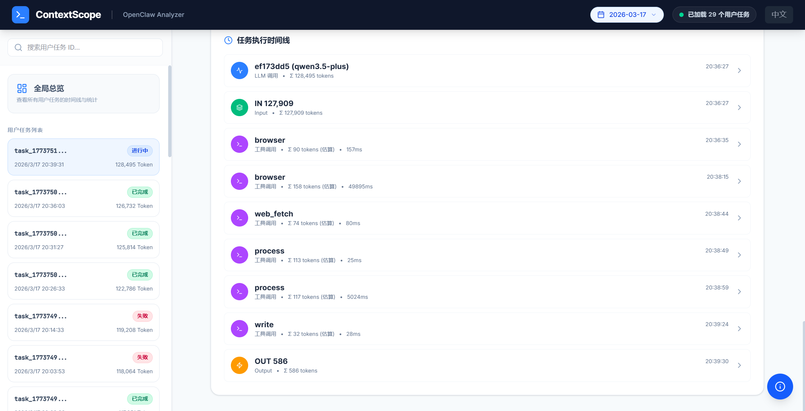
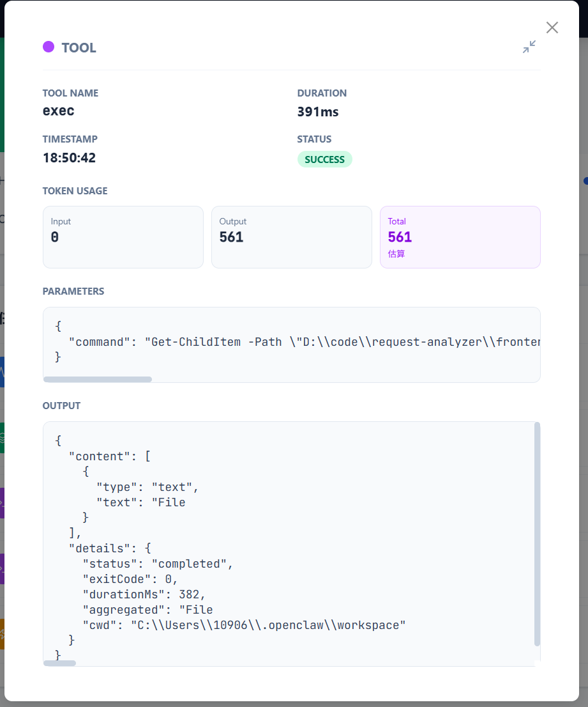
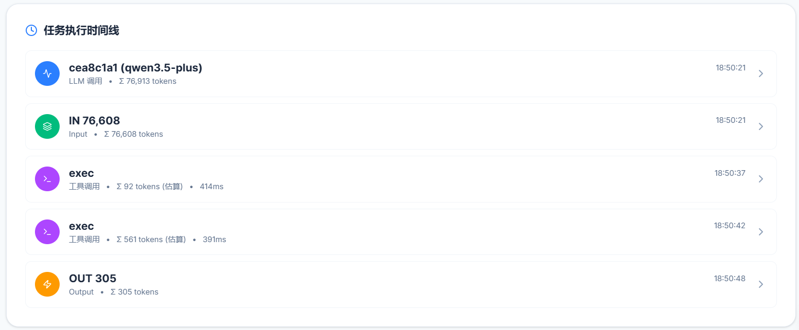
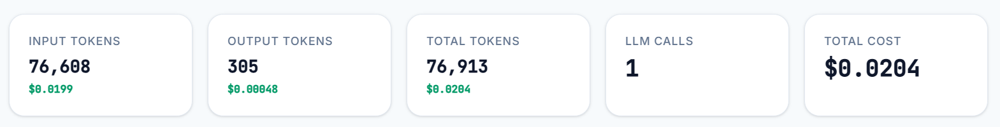
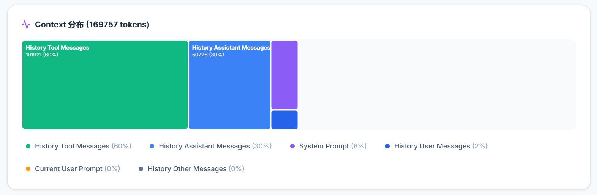

# ContextScope for OpenClaw

> **清楚知道你的 AI 预算花在哪里** —— 可视化每个 LLM 请求的 Token 使用和成本，像 Chrome DevTools 一样调试 AI 应用

[](https://www.npmjs.com/package/openclaw-contextscope)
[](https://openclaw.ai)

[English](README.md) | 简体中文

## 🚀 ContextScope 的独特之处

**问题所在**：你在 openclaw 上花了钱，却不知道钱花在哪里。哪些请求最昂贵？是什么推高了你的 Token 使用量？

**解决方案**：ContextScope 让你清楚知道每一分钱花在哪里 —— 每个请求、每个模型、每次对话。

与 OpenClaw 内置的可观测性工具相比，**ContextScope** 提供了：

| 功能特性 | ContextScope（本插件） | OpenClaw 原生工具 |
|---------|----------------------|------------------|
| **可视化仪表板** | ✅ 完整的 React 交互界面 | ❌ 仅命令行日志 |
| **Token 细分解** | ✅ 单请求 Token 分析（系统/历史/工具/输出） | ⚠️ 基础使用统计 |
| **上下文矩形树图** | ✅ 消息重要性可视化矩形树图 | ❌ 不支持 |
| **时间线视图** | ✅ 可缩放/筛选的交互式时间线 | ❌ 纯文本日志 |
| **子代理追踪** | ✅ 完整的父子运行链路可视化 | ⚠️ 有限的追踪能力 |
| **成本分析** | ✅ 基于模型的成本估算 | ❌ 不支持 |
| **数据导出** | ✅ 支持过滤器的 JSON/CSV 导出 | ❌ 不支持 |
| **自动打开浏览器** | ✅ 网关启动时自动打开仪表板 | ❌ 需手动访问 |

## 📸 项目截图

> **注意**：请将截图文件放在 `screenshots/` 目录下

### 仪表板概览

*所有 AI 请求和成本的实时概览*

### Token 分解 —— 知道你的钱花在哪里

*每个请求的详细 Token 使用分解*

### 时间线视图

*每一个步骤的交互式时间线*

### 成本分析

*按模型和时间段追踪支出*

### 上下文矩形树图

*可视化消息重要性和 Token 分布*

## ✨ 核心功能

### 1. 成本透明 —— 知道你的钱花在哪里
- **单请求成本分解** —— 查看每个 API 调用的确切成本
- **Token 到美元的映射** —— 了解提示词的哪些部分驱动了成本
- **预算追踪** —— 通过可配置的告警实时监控支出
- **导出支出报告** —— 按模型、时间段或对话分析成本

### 2. 实时监控请求
- **类似 Chrome DevTools 的界面**，专为 AI 智能体设计
- 零配置实时捕获请求/响应
- 无需 WebSocket，使用可配置轮询间隔

### 3. Token 级上下文分析
```
系统提示词:  1,234 tokens (12%)
历史消息:    5,678 tokens (56%)
工具结果:    2,345 tokens (23%)
输出内容:      901 tokens (9%)
```
- 精确了解 Token 去向
- 识别上下文膨胀和优化机会

### 4. 上下文矩形树图可视化
- 消息影响力评分的可视化呈现
- 快速识别最重要的历史消息
- 优化上下文窗口使用效率

### 5. 子代理与工具调用追踪
- 完整的父子运行层级关系
- 工具调用依赖关系图
- 子代理 spawn/send/ended 全生命周期追踪

### 6. 成本分析与告警
- 基于模型的成本估算（OpenAI、Anthropic 等）
- 可配置的 Token 和成本阈值
- 高成本操作实时告警

## 📦 安装

```bash
# 通过 OpenClaw CLI 安装
openclaw plugins install openclaw-contextscope

# 或安装特定版本
openclaw plugins install openclaw-contextscope@latest
```

## 🎯 快速开始

### 1. 自动模式（推荐）
简单重启 OpenClaw 网关：
```bash
openclaw gateway restart
```

ContextScope 将自动：
- ✅ 在终端打印醒目的仪表板 URL
- ✅ 自动打开浏览器
- ✅ 立即开始捕获请求

### 2. 手动访问
访问：`http://localhost:18789/plugins/contextscope`

### 3. 聊天命令
在任何 OpenClaw 对话中输入：
```
/analyzer         # 显示插件状态
/analyzer stats   # 查看详细统计
/analyzer open    # 在浏览器中打开仪表板
/analyzer help    # 显示所有命令
```

## ⚙️ 配置

编辑你的 `~/.openclaw/openclaw.json`：

```json
{
  "plugins": {
    "entries": {
      "openclaw-contextscope": {
        "enabled": true,
        "config": {
          "storage": {
            "maxRequests": 10000,
            "retentionDays": 7,
            "compression": true
          },
          "visualization": {
            "theme": "dark",
            "autoRefresh": true,
            "refreshInterval": 5000
          },
          "capture": {
            "includeSystemPrompts": true,
            "includeMessageHistory": true,
            "anonymizeContent": false
          },
          "alerts": {
            "enabled": true,
            "tokenThreshold": 50000,
            "costThreshold": 10.0
          }
        }
      }
    }
  }
}
```

## 🏗️ 架构

```
┌─────────────────────────────────────────────────────────┐
│                    OpenClaw Gateway                      │
│  ┌─────────────────┐         ┌──────────────────────┐  │
│  │  ContextScope   │◄───────►│   React Dashboard    │  │
│  │  Plugin Core    │  HTTP   │   (Vite + Tailwind)  │  │
│  │                 │         │                      │  │
│  │ • LLM Hooks     │         │ • Real-time Charts   │  │
│  │ • Task Tracker  │         │ • Interactive Tables │  │
│  │ • Token Counter │         │ • Export Tools       │  │
│  └────────┬────────┘         └──────────────────────┘  │
│           │                                              │
│           ▼                                              │
│  ┌─────────────────┐                                    │
│  │  JSONL Storage  │  ~/.openclaw/contextscope/         │
│  │  (Compressed)   │                                    │
│  └─────────────────┘                                    │
└─────────────────────────────────────────────────────────┘
```

## 📊 API 端点

| 端点 | 描述 |
|------|------|
| `GET /api/stats` | 整体统计与聚合数据 |
| `GET /api/requests` | 带过滤器的分页请求列表 |
| `GET /api/analysis?runId=xxx` | 详细运行分析 |
| `GET /api/session?sessionId=xxx` | 会话级洞察 |
| `GET /api/export?format=json\|csv` | 数据导出 |
| `GET /api/timeline` | 可视化时间线数据 |
| `GET /api/chains` | 请求链关系 |

## 🔧 开发

### 前置要求
- Node.js 18+
- 已安装 OpenClaw CLI

### 后端（插件）
```bash
cd openclaw-contextscope
npm install
npm run build:backend
```

### 前端（仪表板）
```bash
cd openclaw-contextscope/frontend
npm install
npm run dev        # 开发服务器
npm run build      # 生产构建
```

### 完整构建
```bash
npm run build:all  # 同时构建前端和后端
```

## 🆚 与替代方案对比

| 工具 | 类型 | 实时 | 可视化界面 | Token 分析 | 成本追踪 | OpenClaw 集成 |
|------|------|------|-----------|-----------|---------|--------------|
| **ContextScope** | 插件 | ✅ | ✅ 完整仪表板 | ✅ 详细 | ✅ | ✅ 原生 |
| OpenClaw 原生 | 内置 | ⚠️ 仅日志 | ❌ 命令行 | ⚠️ 基础 | ❌ | ✅ |
| LangSmith | 外部 | ✅ | ✅ | ✅ | ✅ | ❌ 需手动配置 |
| Langfuse | 外部 | ✅ | ✅ | ✅ | ✅ | ❌ 需手动配置 |
| Helicone | 代理 | ✅ | ✅ | ✅ | ✅ | ❌ 需要 API 密钥 |

**ContextScope 优势**：零配置、原生 OpenClaw 集成、无需外部服务或 API 密钥。

## 📝 许可证

MIT 许可证 —— 个人和商业使用均免费。

---

<p align="center">
  <b>专为 OpenClaw 打造</b> —— 以前所未有的方式可视化你的 AI 智能体。
</p>
