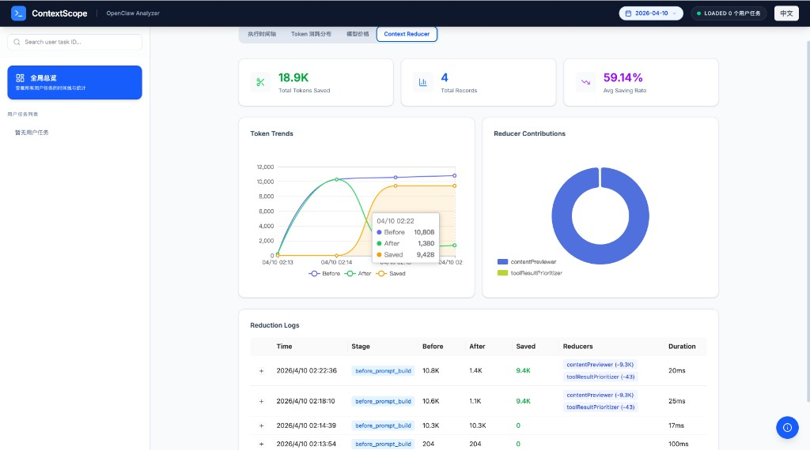

# ContextScope for OpenClaw

> **清楚知道你的 AI 预算花在哪里** —— 可视化每个 LLM 请求的 Token 使用和成本，像 Chrome DevTools 一样调试 AI 应用

[](https://www.npmjs.com/package/openclaw-contextscope)
[](https://openclaw.ai)

[English](README.md) | 简体中文

## 🚀 ContextScope 的独特之处

**问题所在**：你在 openclaw 上花了钱，却不知道钱花在哪里。哪些请求最昂贵？是什么推高了你的 Token 使用量？

**解决方案**：ContextScope 让你清楚知道每一分钱花在哪里 —— 每个请求、每个模型、每次对话。

与 OpenClaw 内置的可观测性工具相比，**ContextScope** 提供了：

| 功能特性 | ContextScope（本插件） | OpenClaw 原生工具 |
|---------|----------------------|------------------|
| **可视化仪表板** | ✅ 完整的 React 交互界面 | ❌ 仅命令行日志 |
| **Token 细分解** | ✅ 单请求 Token 分析（系统/历史/工具/输出） | ⚠️ 基础使用统计 |
| **上下文矩形树图** | ✅ 消息重要性可视化矩形树图 | ❌ 不支持 |
| **时间线视图** | ✅ 可缩放/筛选的交互式时间线 | ❌ 纯文本日志 |
| **子代理追踪** | ✅ 完整的父子运行链路可视化 | ⚠️ 有限的追踪能力 |
| **成本分析** | ✅ 基于模型的成本估算 | ❌ 不支持 |
| **数据导出** | ✅ 支持过滤器的 JSON/CSV 导出 | ❌ 不支持 |
| **自动打开浏览器** | ✅ 网关启动时自动打开仪表板 | ❌ 需手动访问 |

## 📸 项目截图

> **注意**：请将截图文件放在 `screenshots/` 目录下

### 仪表板概览

*所有 AI 请求和成本的实时概览*

### Token 分解 —— 知道你的钱花在哪里

*每个请求的详细 Token 使用分解*

### 时间线视图

*每一个步骤的交互式时间线*

### 成本分析

*按模型和时间段追踪支出*

### 上下文矩形树图

*可视化消息重要性和 Token 分布*

### 上下文裁剪（Context Reducer）

*示例：仅 **4** 条裁剪记录（图中「总记录数」，对应本会话里约 **4 轮** `before_prompt_build`），平均节省率即达 **近 60%** —— 趋势、各策略贡献与日志。*

## ✨ 核心功能

### 1. 成本透明 —— 知道你的钱花在哪里
- **单请求成本分解** —— 查看每个 API 调用的确切成本
- **Token 到美元的映射** —— 了解提示词的哪些部分驱动了成本
- **预算追踪** —— 通过可配置的告警实时监控支出
- **导出支出报告** —— 按模型、时间段或对话分析成本

### 2. 实时监控请求
- **类似 Chrome DevTools 的界面**，专为 AI 智能体设计
- 零配置实时捕获请求/响应
- 无需 WebSocket，使用可配置轮询间隔

### 3. Token 级上下文分析
```
系统提示词:  1,234 tokens (12%)
历史消息:    5,678 tokens (56%)
工具结果:    2,345 tokens (23%)
输出内容:      901 tokens (9%)
```
- 精确了解 Token 去向
- 识别上下文膨胀和优化机会

### 4. 上下文矩形树图可视化
- 消息影响力评分的可视化呈现
- 快速识别最重要的历史消息
- 优化上下文窗口使用效率

### 5. 子代理与工具调用追踪
- 完整的父子运行层级关系
- 工具调用依赖关系图
- 子代理 spawn/send/ended 全生命周期追踪

### 6. 成本分析与告警
- 基于模型的成本估算（OpenAI、Anthropic 等）
- 可配置的 Token 和成本阈值
- 高成本操作实时告警

## 🧠 上下文裁剪（Context Reducer）

ContextScope 在 **`before_prompt_build`** 阶段对即将发给模型的对话做 **原地压缩**（与 OpenClaw 使用同一 `messages` 引用），通过固定顺序的 **pipeline** 减少 Token。

看板示例见上方 **项目截图** 中的 **上下文裁剪**：该次仅 **4** 条裁剪记录（**总记录数**），平均节省约 **60%**，并展示各 reducer 贡献（如 `contentPreviewer`、`toolResultPrioritizer`）。

**执行顺序**（先去重，后续步骤再处理唯一内容）：

| 步骤 | 策略 | 作用 |
|------|------|------|
| 1 | **duplicateDeduper（去重）** | 同一工具、相同参数多次调用时，较早的 tool 结果替换为简短占位，保留较新的一条。 |
| 2 | **toolInputTrimmer（参数裁剪）** | 对「最近 N 轮」**之前**的 assistant 消息里，过长的 **tool call 参数**做截断/摘要；与 **error** tool 结果配对的调用会保留。 |
| 3 | **contentPreviewer（大段预览）** | 旧轮中过大的 tool 结果改为 **前若干行 + 后若干行** 预览；写文件等写操作类工具在此步跳过，由下一步处理。 |
| 4 | **toolResultPrioritizer（结果分级）** | **错误**结果保留；**写操作成功**结果压成占位；其余过长内容按上限 **截断**。 |

**横切配置**

- **`preserveRecentTurns`** — 最近多少轮 assistant 侧内容尽量不动（代码默认 **2**）。
- **`logging`** — 是否记录每次裁剪的统计（尽力而为，失败不影响主流程）。

在插件配置的 **`contextReducer`** 下调整；完整字段与默认值见仓库中的 `openclaw.plugin.json`。

## 📦 安装与首次运行

下文以 **本地克隆 + `npm run build` + `openclaw plugins install -l`** 为主流程；从 npm 安装为备选。

### 从本仓库安装（开发 / 本地路径）

OpenClaw 加载插件后，ContextScope 会 **自行启动 HTTP 服务**（默认 **`127.0.0.1:18790`**，环境变量 `PORT` 可改）。该进程提供 **`/api/...` REST** 与 **`/plugins/contextscope` 看板**（需已执行 `npm run build:all` 生成 `dist/frontend`）。

```bash
cd /path/to/ContextScope
npm install
npm run build              # 编译后端 → dist/index.js（必须）
# 可选：打包前端到 dist/frontend
npm run build:all

openclaw plugins install -l /path/to/ContextScope
openclaw plugins list
openclaw gateway restart
```

- 本仓库在 `openclaw.plugin.json` 中的 id 为 **`contextscope`**；npm 包可能不同 —— 务必与 **`openclaw plugins list`** 中 `plugins.entries` 的键名一致。

### 从 npm 安装

```bash
openclaw plugins install openclaw-contextscope@latest
openclaw gateway restart
openclaw plugins list
```

### 打开看板与接口

| 说明 | 默认地址 |
|------|----------|
| **看板**（由 ContextScope 进程提供） | `http://127.0.0.1:18790/plugins/contextscope` |
| **REST API**（同一进程） | `http://127.0.0.1:18790/api/...` |
| **经 OpenClaw 网关访问**（若网关做了反向代理） | 常见为 `http://localhost:18789/plugins/contextscope`，**网关端口以你的环境为准** |

终端若打印其它访问地址，以实际输出为准。安装后请用 **`openclaw plugins list`** 确认插件已加载。

### 聊天命令（可选）

```
/analyzer         # 显示插件状态
/analyzer stats   # 查看详细统计
/analyzer open    # 在浏览器中打开仪表板
/analyzer help    # 显示所有命令
```

## ⚙️ 配置

编辑 OpenClaw 配置，常见位置：

- `~/.openclaw/openclaw.json`（JSON）
- 同目录下的 **`openclaw.yaml`**（若你的环境使用 YAML——**字段含义一致**，仅语法不同）

在 `plugins.entries.<插件id>.config` 下配置存储、可视化、采集、告警，以及 **`contextReducer`** 裁剪流水线。每个 reducer 可用各自的 **`enabled`** 单独开关；将顶层 **`contextReducer.enabled`** 设为 `false` 可关闭整条流水线。

`entries` 下的键名须与 **`openclaw plugins list`** 一致：本仓库 **`install -l`** 一般为 **`contextscope`**；npm 安装常为 **`openclaw-contextscope`**。

```json
{
  "plugins": {
    "entries": {
      "contextscope": {
        "enabled": true,
        "config": {
          "storage": {
            "maxRequests": 10000,
            "retentionDays": 7,
            "compression": true
          },
          "visualization": {
            "theme": "dark",
            "autoRefresh": true,
            "refreshInterval": 5000
          },
          "capture": {
            "includeSystemPrompts": true,
            "includeMessageHistory": true,
            "anonymizeContent": false
          },
          "alerts": {
            "enabled": true,
            "tokenThreshold": 50000,
            "costThreshold": 10.0
          },
          "contextReducer": {
            "enabled": true,
            "preserveRecentTurns": 2,
            "duplicateDeduper": { "enabled": true },
            "toolInputTrimmer": { "enabled": true, "maxInputChars": 200 },
            "contentPreviewer": {
              "enabled": true,
              "minContentChars": 500,
              "headLines": 10,
              "tailLines": 5
            },
            "toolResultPrioritizer": { "enabled": true, "lowPriorityMaxChars": 100 },
            "logging": { "enabled": true }
          }
        }
      }
    }
  }
}
```

**YAML 示例**（`contextReducer` 结构相同；若 `plugins list` 显示其它 id，请替换 `contextscope`）：

```yaml
plugins:
  entries:
    contextscope:
      enabled: true
      config:
        contextReducer:
          enabled: true
          preserveRecentTurns: 2
          duplicateDeduper:
            enabled: false
          toolInputTrimmer:
            enabled: true
            maxInputChars: 200
          contentPreviewer:
            enabled: true
            minContentChars: 500
            headLines: 10
            tailLines: 5
          toolResultPrioritizer:
            enabled: true
            lowPriorityMaxChars: 100
          logging:
            enabled: true
```

将某个子项（如 `duplicateDeduper.enabled`）设为 `false` 仅跳过该步骤，其余 reducer 仍按固定顺序执行。

## 🏗️ 架构

```
┌─────────────────────────────────────────────────────────┐
│                    OpenClaw Gateway                      │
│  ┌──────────────────────────────┐                      │
│  │  ContextScope 插件         │  HTTP :18790 (PORT) │
│  │  • dist/index.js + hooks     │  /api/* , /plugins/…│
│  │  • 内嵌 Express 服务         │                      │
│  └────────┬─────────────────────┘                      │
│           │         ▲                                    │
│           │         └── React 看板 (dist/frontend)      │
│           ▼                                              │
│  ┌─────────────────┐                                    │
│  │  JSONL Storage  │  ~/.openclaw/contextscope/         │
│  │  (Compressed)   │                                    │
│  └─────────────────┘                                    │
└─────────────────────────────────────────────────────────┘
```

网关也可能在其它端口反向代理界面；**本仓库中的 HTTP API 由插件进程提供**（默认 **`127.0.0.1:18790`**）。

## 📊 API 端点

默认基地址：`http://127.0.0.1:18790`

| 端点 | 描述 |
|------|------|
| `GET /api/stats` | 整体统计与聚合数据 |
| `GET /api/requests` | 带过滤器的分页请求列表 |
| `GET /api/analysis?runId=xxx` | 详细运行分析 |
| `GET /api/session?sessionId=xxx` | 会话级洞察 |
| `GET /api/export?format=json\|csv` | 数据导出 |
| `GET /api/timeline` | 可视化时间线数据 |
| `GET /api/chains` | 请求链关系 |
| `GET /api/reduction-logs` | 上下文裁剪运行日志 |
| `GET /api/reduction-logs/summary` | 裁剪统计汇总 |

## 🔧 开发

### 前置要求
- Node.js 18+
- 已安装 OpenClaw CLI

### 后端（插件核心）
```bash
cd ContextScope   # 仓库根目录
npm install
npm run build       # 等同 npm run build:backend（tsc）
```

### 前端（看板）
```bash
cd ContextScope/frontend
npm install
npm run dev         # Vite 开发服务器
npm run build       # 产物 → frontend/dist
```

### 完整构建与本地安装
```bash
cd ContextScope
npm run build:all   # 后端 tsc + 拷贝 frontend/dist → dist/frontend
openclaw plugins install -l "$(pwd)"
openclaw gateway restart
```

## 🆚 与替代方案对比

| 工具 | 类型 | 实时 | 可视化界面 | Token 分析 | 成本追踪 | OpenClaw 集成 |
|------|------|------|-----------|-----------|---------|--------------|
| **ContextScope** | 插件 | ✅ | ✅ 完整仪表板 | ✅ 详细 | ✅ | ✅ 原生 |
| OpenClaw 原生 | 内置 | ⚠️ 仅日志 | ❌ 命令行 | ⚠️ 基础 | ❌ | ✅ |
| LangSmith | 外部 | ✅ | ✅ | ✅ | ✅ | ❌ 需手动配置 |
| Langfuse | 外部 | ✅ | ✅ | ✅ | ✅ | ❌ 需手动配置 |
| Helicone | 代理 | ✅ | ✅ | ✅ | ✅ | ❌ 需要 API 密钥 |

**ContextScope 优势**：零配置、原生 OpenClaw 集成、无需外部服务或 API 密钥。

## 📝 许可证

MIT 许可证 —— 个人和商业使用均免费。

---

<p align="center">
  <b>专为 OpenClaw 打造</b> —— 以前所未有的方式可视化你的 AI 智能体。
</p>
